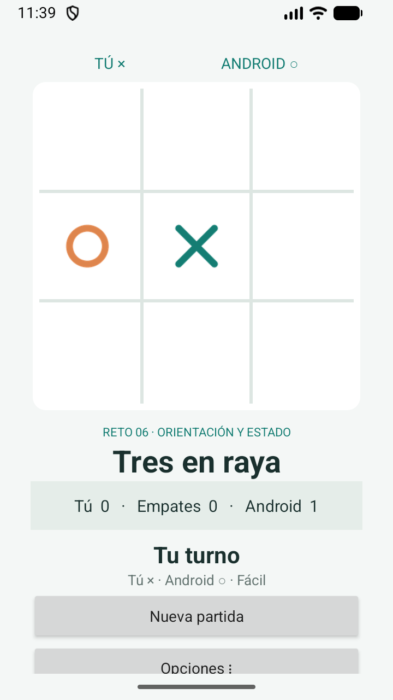
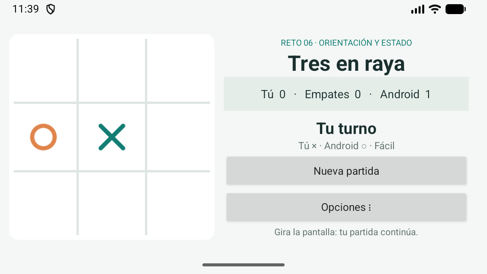
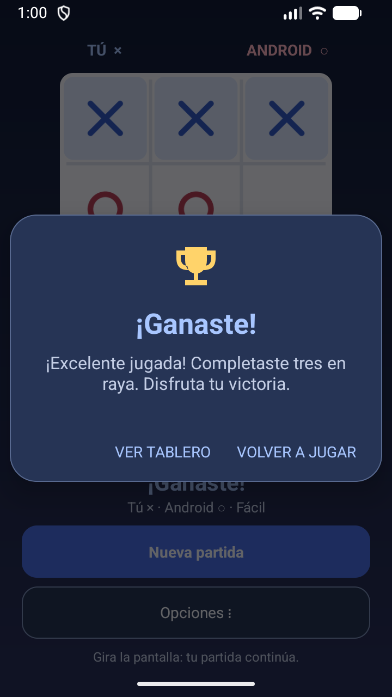
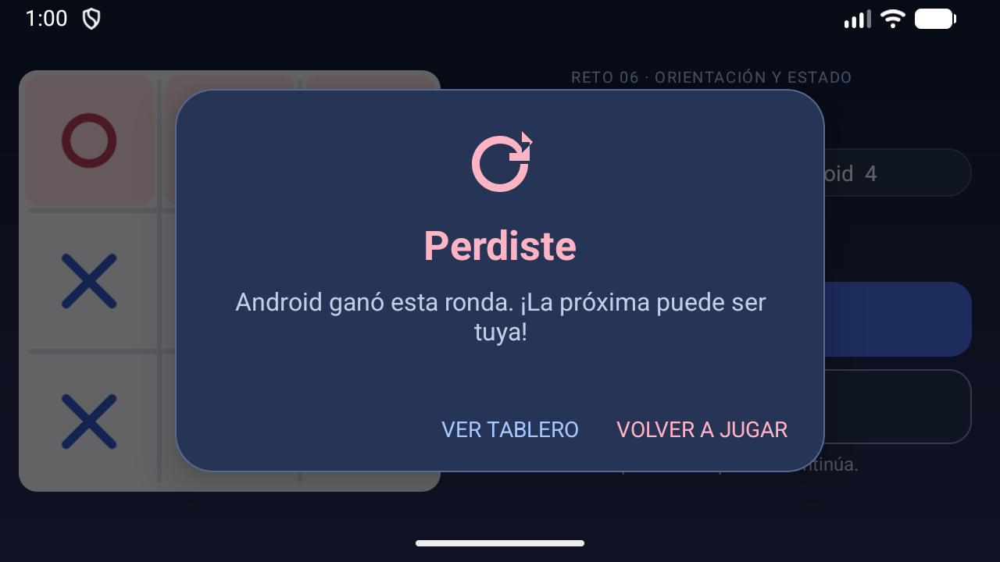

# Validación del Reto 6

Fecha: 3 de octubre de 2026.

Compilación final: `assembleDebug testDebugUnitTest lintDebug`, BUILD SUCCESSFUL.
Las 8 pruebas unitarias pasan (0 errores, 0 fallos), incluyendo copias defensivas del tablero y exploración de todas las continuaciones humanas contra Experto.
Lint: 0 errores; avisos sobre textos en recursos/compatibilidad de APIs, sin bloqueo de compilación.

## Emulador Small Phone, API 37, 720 × 1280, 320 dpi
- Girar durante la espera: exactamente una X y una O, vuelve el turno humano — PASS
- Volver a vertical conserva todas las fichas y el turno — PASS
- Partida llega a un resultado — PASS
- Girar después del resultado conserva tablero y no duplica el marcador — PASS
- Seleccionar dificultad actualiza la pantalla — PASS
- Cerrar con Atrás y reabrir conserva marcadores y dificultad — PASS
- Cerrar con Atrás y reabrir inicia un tablero nuevo — PASS
- Reiniciar marcadores muestra cero — PASS
- Marcadores reiniciados y dificultad sobreviven a reinicio del proceso — PASS
- Archivo persistente confirma marcadores cero y dificultad Fácil — PASS

No se bloquea la orientación y la Activity se recrea realmente. Se desactiva el guardado automático del contenedor raíz porque el mismo ID corresponde a ScrollView en vertical y LinearLayout en horizontal; la partida se restaura explícitamente desde Bundle. El retorno predictivo usa OnBackInvokedDispatcher en API 33+ y onBackPressed es solo el respaldo para versiones anteriores.

La ejecución en API 24–36 no se probó en dispositivos separados.

## Sonidos de resultado
- Victoria: melodía ascendente original; derrota: melodía descendente original.
- Prueba instrumental en Small Phone API 37: victoria, derrota, retención del mismo reproductor durante recreación, preferencia activada conservada, silencio y empate: 6 comprobaciones aprobadas.
- La rotación automática del emulador queda activada; no cambia la opción Sonido.
- Compilación, 8 pruebas unitarias y Lint completados correctamente.
- Ejecutar la prueba de audio: instalar el APK de `assembleDebugAndroidTest` y ejecutar `adb shell am instrument -w com.hernandovela.reto6.test/com.hernandovela.reto6.OutcomeSoundInstrumentation`.

## Mejora de experiencia visual

Paleta aplicada el 3 de octubre de 2026:

| Elemento | Color |
| --- | --- |
| X del jugador | Azul `#3159C9` |
| O de Android | Frambuesa `#B83F58` |
| Fondo | Degradado `#111C38` → `#29305B` |
| Tablero | Claro `#F7F8FF` |
| Acción Nueva partida | Azul `#496EE8` |

La leyenda identifica a cada jugador con su color; la línea ganadora y el texto del resultado usan el color correspondiente. Las formas X/O y los mensajes permiten distinguir el resultado sin depender únicamente del color.

Las capturas vertical y horizontal anteriores se reemplazaron por capturas reales de la nueva interfaz con la misma partida: una X, una O y el mismo marcador. Se verificaron botones completos de 48 dp en vertical y conservación del tablero, turno, marcador y dificultad al girar en ambos sentidos. La rotación automática queda activada al terminar.

Validación final: compilación y Lint sin errores, 8 pruebas unitarias aprobadas y 6 comprobaciones instrumentales de audio aprobadas. Ver [comprobaciones del diseño](VALIDACION-DISENO.json).

## Popups de victoria y derrota

- Victoria: trofeo, título «¡Ganaste!» y mensaje de celebración.
- Derrota: título «Perdiste» y mensaje para volver a intentarlo.
- Ambos incluyen «Volver a jugar» y «Ver tablero», con la paleta de colores de la aplicación.
- El popup abierto se restaura al girar. Después de cerrarlo, no vuelve a aparecer al girar ni se incrementa otra vez el marcador.
- El sonido de resultado se conserva durante el giro. Silenciar el audio no desactiva los popups.
- El empate conserva su mensaje en el tablero.

La prueba instrumental prepara posiciones previas a la última jugada y ejecuta los movimientos reales de la aplicación. Verifica títulos, visibilidad, rotación, cierre, nueva partida y reproducción del audio. Resultado: PASS. Compilación, 8 pruebas unitarias y Lint sin errores.

[Salida de la prueba instrumental](VALIDACION-POPUPS.txt).

